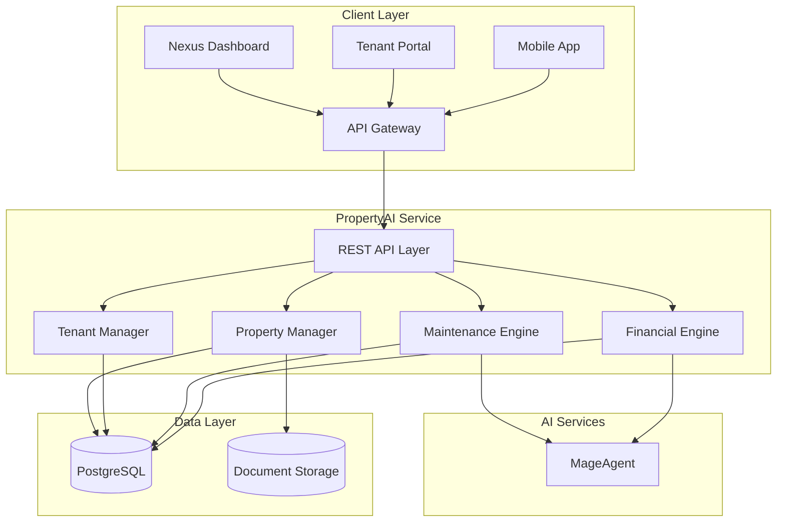
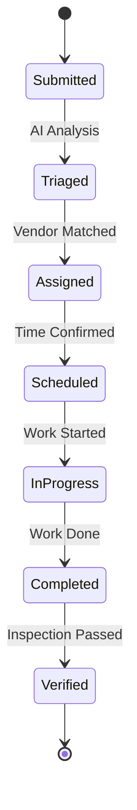
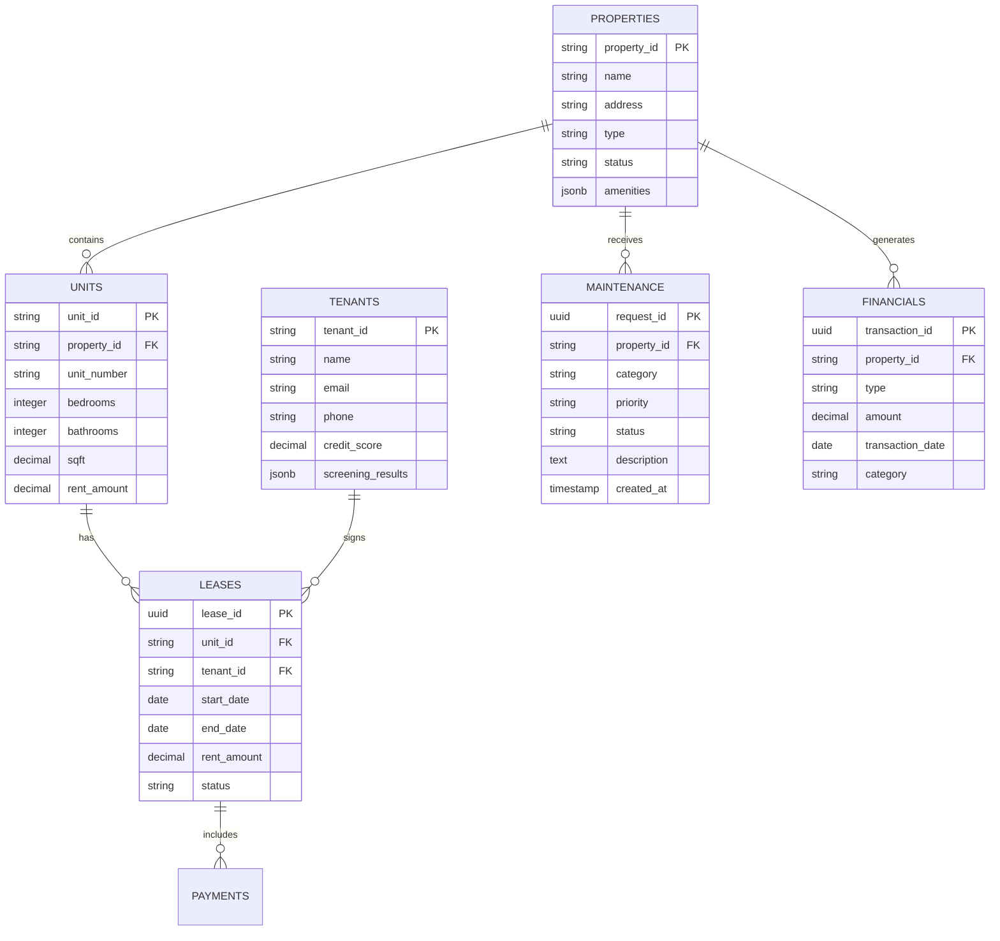
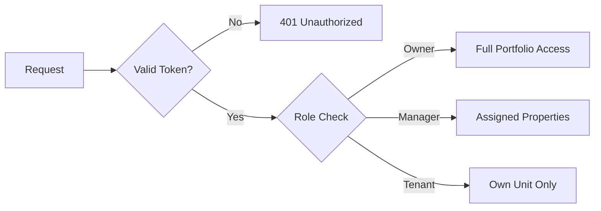
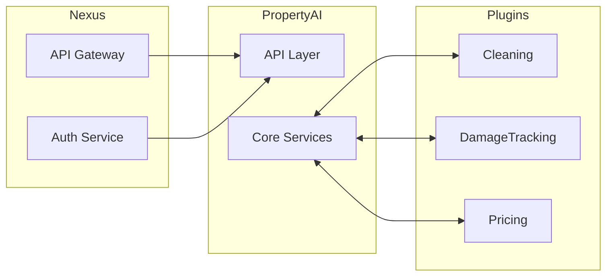

# PropertyAI Architecture

Technical architecture and system design for the PropertyAI property management plugin.

---

## System Overview



---

## Core Components

### 1. REST API Layer

| Endpoint | Method | Description |
|----------|--------|-------------|
| `/api/v1/properties` | GET | List properties |
| `/api/v1/tenants` | POST | Add tenant |
| `/api/v1/maintenance` | POST | Create maintenance request |
| `/api/v1/financials/:propertyId` | GET | Get financial summary |

### 2. Property Manager

Handles property lifecycle and configuration.

**Capabilities:**
- Property CRUD operations
- Unit management
- Amenity tracking
- Document management

### 3. Tenant Manager

Manages tenant relationships and communications.

**Features:**
- Tenant profiles
- Lease management
- Communication history
- Payment tracking

### 4. Maintenance Engine

AI-powered maintenance request handling.



### 5. Financial Engine

Comprehensive financial tracking and reporting.

**Metrics:**
- Revenue tracking
- Expense management
- P&L statements
- Cap rate calculations
- Cash flow analysis

---

## Data Model



---

## Security Model

### Authentication
- Bearer token via Nexus API Gateway
- Tenant portal uses separate auth flow
- Multi-factor authentication for sensitive operations

### Authorization
- Role-based: Owner, Manager, Maintenance, Tenant
- Property-level permissions
- Data isolation by portfolio



---

## Deployment Architecture

### Kubernetes Configuration

```yaml
apiVersion: apps/v1
kind: Deployment
metadata:
  name: nexus-propertymgmt
  namespace: nexus-plugins
spec:
  replicas: 3
  selector:
    matchLabels:
      app: nexus-propertymgmt
  template:
    spec:
      containers:
      - name: property-api
        image: adverant/nexus-propertymgmt:1.0.0
        ports:
        - containerPort: 8080
        resources:
          requests:
            memory: "1Gi"
            cpu: "500m"
          limits:
            memory: "2Gi"
            cpu: "1000m"
        livenessProbe:
          httpGet:
            path: /live
            port: 8080
        readinessProbe:
          httpGet:
            path: /ready
            port: 8080
```

### Resource Allocation

| Resource | Request | Limit |
|----------|---------|-------|
| CPU | 500m | 1000m |
| Memory | 1Gi | 2Gi |
| Disk | 5Gi | 10Gi |

---

## Integration Points

### Nexus Platform



### Event Bus

| Event | Payload | Subscribers |
|-------|---------|-------------|
| `property.lease.created` | Lease details | Billing, Notifications |
| `property.maintenance.created` | Request details | Vendors, Scheduling |
| `property.payment.received` | Payment details | Accounting, Reports |

---

## Performance

### Rate Limits

| Tier | Requests/min | Concurrent |
|------|--------------|------------|
| Starter | 60 | 5 |
| Professional | 300 | 15 |
| Enterprise | Custom | Custom |

### Caching

- Property data: 5 minute TTL
- Financial summaries: 1 hour TTL
- Tenant profiles: 15 minute TTL

---

## Monitoring

### Metrics (Prometheus)

```
# Property metrics
property_units_total{status}
property_occupancy_rate{property_id}
property_maintenance_open{priority}

# Financial metrics
property_revenue_total{property_id}
property_expenses_total{category}
property_noi{property_id}
```

### Alerting

| Alert | Condition | Severity |
|-------|-----------|----------|
| High Vacancy | >20% vacant units | Warning |
| Payment Overdue | >5 days late | Warning |
| Emergency Maintenance | Unassigned >1 hour | Critical |

---

## Next Steps

- [Quick Start Guide](./QUICKSTART.md) - Get started quickly
- [Use Cases](./USE-CASES.md) - Implementation scenarios
- [API Reference](./docs/api-reference/endpoints.md) - Complete docs
